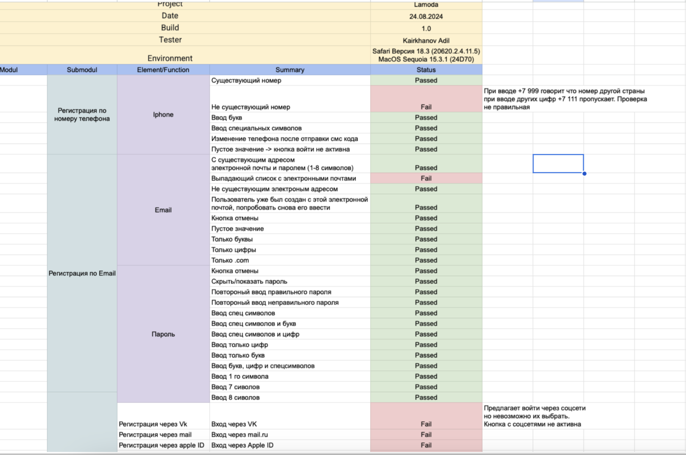

# 📂 Чек-листы

## 🔎 Реальные проекты
- [Скачать чек-лист (Excel)](./lamodachecklist.xlsx)
  
  📸 [Скриншот таблицы]

---

## 🧩 Учебные примеры
В этом репозитории собраны примеры чек-листов для тестирования веб-приложений.  
Каждый файл описывает набор проверок для отдельного модуля: форма логина, регистрация, корзина интернет-магазина, форма обратной связи.  

### 📂 Чек-листы
- **Форма логина** — проверка полей ввода, кнопки "Войти", сообщений об ошибках.  
- **Регистрация** — обязательные и необязательные поля, валидация email и пароля.  
- **Корзина** — добавление и удаление товаров, корректность суммы.  
- **Форма обратной связи** — отправка сообщения, обязательные поля, вложения.  

---

### 🛠️ Пример чек-листа (Login Form)

- [ ] Проверить наличие поля "Email".  
- [ ] Проверить наличие поля "Пароль".  
- [ ] Проверить, что кнопка "Войти" неактивна при пустых полях.  
- [ ] Проверить сообщение об ошибке при неверном пароле.  
- [ ] Проверить успешный вход с корректными данными.  
- [ ] Проверить переход в личный кабинет после логина.  
- [ ] Проверить кросс-браузерность (Chrome, Firefox, Safari).  

---

📌 Репозиторий создан для демонстрации навыков составления чек-листов начинающим QA.
